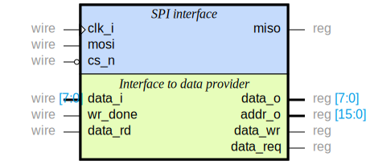

# Verilog SPI module for TwPM project

This is FPGA based implementation of Serial Peripheral Interface (SPI) written
in Verilog HDL language. While SPI is a _de facto_ standard with many variants
used for different application, this implementation focuses on TPM protocol. As
such, only SPI mode 0 is supported (CPHA=0, CPOL=0). In addition, TPM
specification defines a method of flow control that operates on a transaction
basis that isn't used anywhere else. For these reasons, if you're  looking for a
code for use with SPI flash, sensors, SD cards or other components, this isn't
the repository you're looking for.

## Module diagram



Inputs are on the left side, outputs on the right.

## Simulation

### Prerequisites

Here is short tutorial how to simulate `SPI Peripheral` using the
`Icarus Verilog` and `GTKWave` packages.

First of all we, have to install `Icarus Verilog` package in your Linux
distribution. One can succeed this task in two ways:

- [installation from sources](https://iverilog.fandom.com/wiki/Installation_Guide)
- [installation from package repository](https://zoomadmin.com/HowToInstall/UbuntuPackage/iverilog)

You can also start with a
[short tutorial](https://iverilog.fandom.com/wiki/Getting_Started) showing how
to perform basic tasks in the `Icarus Verilog` tool.

After installation is done, we can try to run simulation of Verilog sources.
Apart from making sources for Verilog module, making test-bench in Verilog is
a must. So summing it up, we need to have two Verilog files:
- tested module sources
- test-bench with stimulus for tested package

### Running simulation

1. Clone this repository:

```bash
git clone https://github.com/Dasharo/verilog-spi-module.git
```

2. Now we can compile the Verilog module (source) to a format which Verilog
   simulator understands:

```bash
iverilog -o spi_peri_module spi_periph_tb.v spi.v
```

3. After compilation has ended, we can use `vvp` tool to generate the `.vcd`
   file with timing simulation content:

```bash
vvp -n spi_peri_module
```

You should see similar output from testbench:

```text
VCD info: dumpfile spi_periph_tb.vcd opened for output.
Performing TPM write w/o delay
Performing TPM write with delay
Performing TPM read with delay
Performing TPM read w/o delay
Testing transfers with scattered clock between bytes
Testing over-sized transfers
Testing non-TPM addresses
Testing crossing registers boundary
```

Order, description and number of tests may change in the future. Make sure that
the output doesn't contain lines starting with `###`, those are used to report
errors in the behaviour of SPI module.

As a result, `spi_periph_tb.vcd` file containing simulation results (timing
diagrams) will be produced.

4. To see simulation results in graphical tool:

```bash
gtkwave spi_periph_tb.vcd
```

## Funding

This project was partially funded through the
[NGI Assure](https://nlnet.nl/assure) Fund, a fund established by
[NLnet](https://nlnet.nl/) with financial support from the European
Commission's [Next Generation Internet](https://ngi.eu/) programme, under the
aegis of DG Communications Networks, Content and Technology under grant
agreement No 957073.

<p align="center">

&nbsp;&nbsp;&nbsp;&nbsp;&nbsp;&nbsp;&nbsp;&nbsp;&nbsp;

</p>
